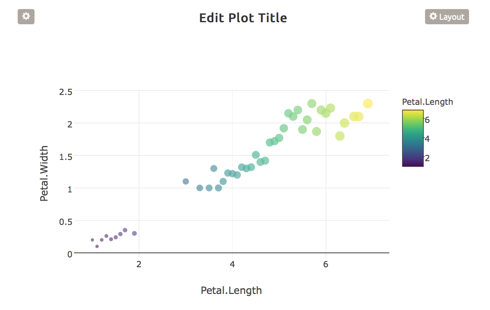
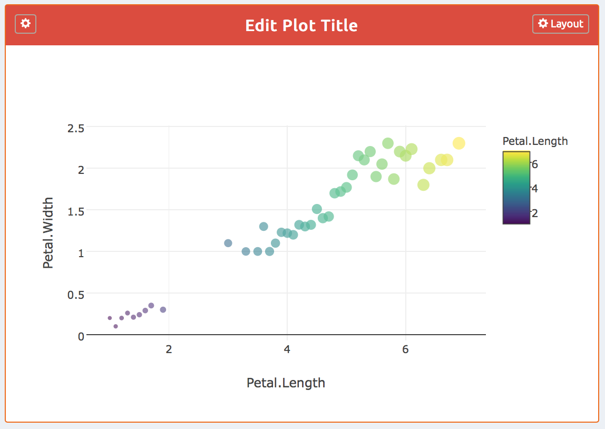
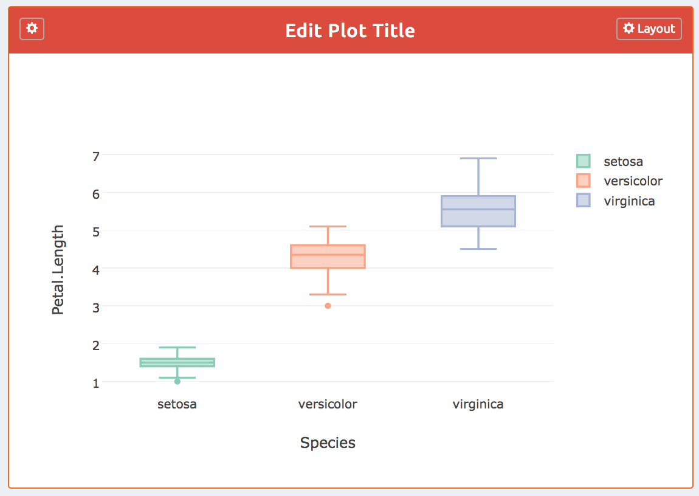
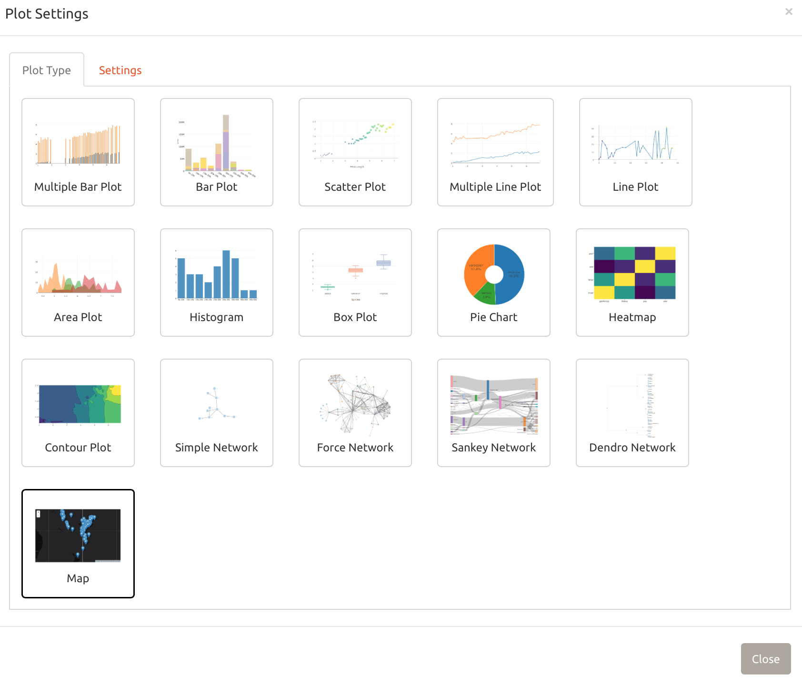
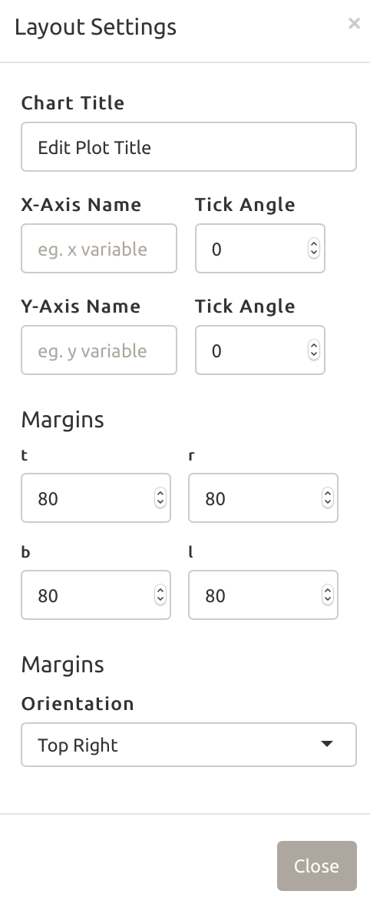

# Introduction {#intro}

This book is a guide to dynamically creating plots using `plotbuildr`. 

It is not a comprehensive introduction to the `htmlwidgets`, such as `plotly`, `leaflet`, and `networkD3`, on top of which `plotbuildr` was built. To learn more about these packages please refer to the links provided in the [references]. You do not have to be an expert of the R language [@R-base] or `shiny` [@R-shiny] to read this book, but you are expected to have some basic knowledge about `shiny`. For beginners, you may get started with the [cheat-sheets](https://www.rstudio.com/resources/cheatsheets). The [getting started] section also provides a basic template to launch a `shiny` app with `plotbuildr`.

<!-- You can label chapter and section titles using `{#how-to}` after them, e.g., we can reference Chapter \@ref(intro). If you do not manually label them, there will be automatic labels anyway, e.g., Chapter \@ref(methods). -->

<!-- Figures and tables with captions will be placed in `figure` and `table` environments, respectively. -->

<!-- ```{r nice-fig, fig.cap='Here is a nice figure!', out.width='80%', fig.asp=.75, fig.align='center'} -->
<!-- par(mar = c(4, 4, .1, .1)) -->
<!-- plot(pressure, type = 'b', pch = 19) -->
<!-- ``` -->

<!-- Reference a figure by its code chunk label with the `fig:` prefix, e.g., see Figure \@ref(fig:nice-fig). Similarly, you can reference tables generated from `knitr::kable()`, e.g., see Table \@ref(tab:nice-tab). -->

<!-- ```{r nice-tab, tidy=FALSE} -->
<!-- knitr::kable( -->
<!--   head(iris, 20), caption = 'Here is a nice table!', -->
<!--   booktabs = TRUE -->
<!-- ) -->
<!-- ``` -->

<!-- You can write citations, too. For example, we are using the **bookdown** package [@R-bookdown] in this sample book, which was built on top of R Markdown and **knitr** [@xie2015]. -->

## Installation {-}

<!-- If you have R installed, you can install the stable release of plotly by typing this in your R console: -->

<!-- install.packages("plotbuildr") -->

You can install the development release via the `devtools` [@R-devtools] package:

> Purposely hidden 

<!-- ```{r, eval = F} -->
<!-- if (!require("devtools")) install.packages("devtools") -->

<!-- devtools::install_github('ThinkBigAnalytics/plotbuildr') -->

<!-- ``` -->

The version of the R package used to build this site is:

```{r, eval=F}
packageVersion("plotbuildr")
#> [1] '0.1.2'
```

## Getting Started {-}

Copy and paste the code below in your R console to run your basic `shiny` app with `plotbuildr`

```{r, eval =F}
library(plotbuildr)

df_list <- list()
df_list <- "iris"

## Ui Logic
ui <- fluidPage(
  fluidRow(
    column(
      width = 5,
      plotbuildr::plotbuildrOutput("plot")
    )
  )
)

## Server Logic
server <- function(input, output, session){
  
  renderPlotbuildr("plot", 
                   df_list = df_list)
}

shinyApp(ui, server)
```

Running the above code will launch a `shiny` app and will display a `plotbuildr` plot similar to the one displayed below

```{r, echo=F}

```

> Note that the plot generated might be different from what you see in the above image, as the plotbuildr randomly selects the plot if you don't specify the plot type, refer section [plot] for more details

As you can see in the image above, there are 3 main components of a plotbuildr

- The Plot (main body),
- The Plot Settings Button (on the top left), and
- The Layout Settings Button (on the top left)

We will understand each component in detail in the next section

First, let's understand how the code works

### Data Frame List {-}

```{r, eval=F}
df_list <- list()
df_list <- "iris"
```

The `plotbuildr` accepts a `list()` of data frame names loaded in your current `env` to be used to plot. This way you can play with different datasets and try different plots without the need to go back to your R session.

The best way to go about to include all the data frames in your current environment would be to create a *global.R*, load/import all the data frames there and then source *global.R* in your app

```{r, eval =F}
## global.R

iris_df <- iris

mtcars_df <- mtcars

df_list <- ls()
```

What about reactive objects? 

Well, `reactive_df` argument takes a `list()` of reactive data frames to do that. So, you can `filter()` & `mutate()` all you want in your `shiny` app and plot your results.

```{r, eval =F}
## Server Logic

server <- function(input, output, session){
  
  rdf_list <- list()
  
  rdf_list$texas_housing_filtered <- reactive({
    txhousing %>% 
      filter(sales > 100)
  })
  
  renderPlotbuildr("plot", 
                   reactive_df = rdf_list)
}

```


### plotbuildr Output {-}

```{r, eval=F}
plotbuildr::plotbuildrOutput("plot")
```

This is like a standard `shiny` input binding, used to set the id, height and width of the plot.

### Render plotbuildr {-}

```{r, eval =F}
plotbuildr::renderPlotbuildr("plot", df_list = df_list)
```

There are multiple arguments that can be passed in this function. Some arguments are common to all the plots, however there are many arguments that are specific to certain kind of plots, these are mentioned in Chapter \@ref(how-to). To make `plotbuildr` as flexible as possible, there are only two mandatory arguments `id & df_list | reactive_df` that one is expected to pass. All other arguments are optional.

## plotbuildr Components {-}

The `plotbuildr` is, basically, a `shinydashboard::box()` object, in which the plot is rendered in the body of the box and the buttons are placed at the header of the box. If you use the `plotbuildr` in a shiny dashboard [@R-shinydashboard], you can also tweak the `status` and the `solidHeader` argument of the box. See the example below

```{r, eval=F}
## ui part
library(shinydashboard)

ui <- dashboardPage(
  header = dashboardHeader(disable = T), 
  sidebar = dashboardSidebar(disable = T),
  body = dashboardBody(
    fluidPage(
      fluidRow(
        plotbuildr::plotbuildrOutput("plot", col_width = 5, status = "danger", solidHeader = T)
      )
    )
  )
)
```

```{r, echo=F}

```

Let's look at each component of the `plotbuildr` in detail

### Plot {-}

Currently the `plotbuildr` supports 16 interactive plots, which can be generated just by clicking a button. Below is the list of all the plots that can be generated. 

```{r, echo =F}
unlist(eval(as.list(plotbuildr:::plotChoices()$plotChoices_list)), use.names = F)
```

You can pre-select any of these plots by passing the name of the plot in the plot_type argument in `renderPlotbuildr()` function in the server side. See the example below,

```{r, eval = F}
# Server Side
plotbuildr::renderPlotbuildr("plot",  df_list = df_list, plot_type = "Box Plot")
```

```{r, echo=F}

```

### Plot Settings {-}

This is the core of the `plotbuildr`. When you click the plot settings button, a two-tab modal pops up giving you the possibility to choose one of the 16 plots and then toggle its settings. In the settings tab, you will find settings specific to the selected plot. We will go into more detail about this in Chapter \@ref(how-to)

```{r, echo=F}

```

As you can see in the image above, the selected plot is always highlighted. 

### Layout Settings {-}

The layout settings button let's you edit several attributes of the plot, such as titles, margins and legend orientation. These settings are different for different html widgets. This is very helpful, specially for the beginners, as sometimes it can get really cumbersome to tweak these settings for different plots. 

The image below shows the plot settings for *Bar Plot*

```{r, echo=F}

```

