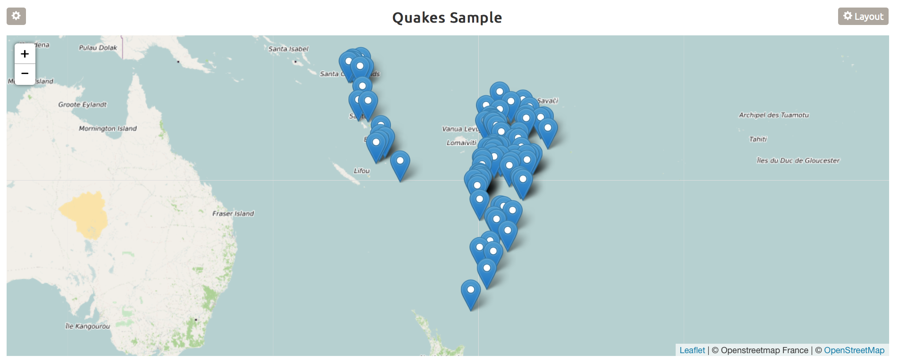

# Going Deeper {#how-to}

This chapter contains detailed description about the arguments each plot takes.

Below are all the arguments that the `plotbuildr::renderPlotbuildr()` function takes

```{r, echo =F}
names(as.list(args(plotbuildr::renderPlotbuildr)))[-29]
```

The reason why we have provided all these arguments is that when you finalize your plot, you can come back to the server side and fix all the arguments, so that you never lose the state of your plot. All the values should be quoted strings, for eg. `df = "iris"`, except for the `df_list` and `reactive_df` arguments, which take a `list()` as value.

As previously mentioned in [plot] section, you can plot several plots using *plotbuildr*. Let's look at them in detail

## Plotly Plots {}

Plotly gives us a very rich interactive visualization library. We have delicately selected the settings, so that you can make a presentable plot with it, without the need to know code to make such plots. 

> Note: If you are expert in Plotly and if it doesn't take more than 2 mins to plot, then we recommend you to stick with it, because plotbuildr gives only limited setting ooptions. 

As the data science and visualization go hand in hand, we have tried to be consistent with the workflow by using some `tidyverse` functions for data analysis and `plotbuildr` to easily visualize the data. 

We will use `gapminder` dataset throughout this section.

### Multiple Bar Plot {}

To plot a Multiple Bar Plot, you can run the Getting Started app given in [getting started] section. Click on the plot settings button, explained in [plot settings] section.

After selecting the Multiple Bar Plot icon and you can go to the Settings tab. 

You will see the following setting options

```{r, echo=F}
knitr::include_graphics("images/mbp_settings.png")
```

The `Dataset Choices` dropdown item let's you select the data frame of your choice from the list that you passed in `df_list` and / or `reactive_df` argument. You can then select the `X-Axis`, `Y-Axis` and `Y2-Axis` from the respective dropdown lists, which contain the column names of the data frame selected.

> Note: plotbuildr automatically checks the column type and only selects dbl or int type columns for Y-Axis

You can also specify the arguments in the server side logic of *plotbuildr*. An example is provided in the sub-section of each plot.

Multiple Bar Plot takes the following arguments

```{r, eval=F}
## x, y, y2, plot_type = "Multiple Bar Plot", title, x_label & y_label 
```

**Example**

Let's start by loading the data and look at the first 6 rows of the dataset

```{r}
library(gapminder)
library(magrittr)

gapminder %>% head(6)
```

Now let's look at the top 2 countries in each continent with highest life expectancy.

Below is the sample code that will launch a shiny app with a Multiple Bar Plot using the user-defined arguments. 

```{r, eval=F}
library(shiny)
library(shinydashboard)
library(gapminder)
library(tidyverse)
library(plotbuildr)
library(gapminder)

ui <- fluidPage(
  fluidRow(
    plotbuildr::plotbuildrOutput("plot", col_width = 8, status = "danger", solidHeader = T)
  )
)

server <- function(input, output, session){
  
  rdf_list <- list()
  
  rdf_list$top_2_cuntries <- reactive({
    gapminder %>% 
      mutate(country = as.character(country)) %>% 
      filter(year >= 2002) %>% 
      group_by(continent, year) %>% 
      top_n(n = 2, wt = lifeExp) %>% 
      select(-pop, -gdpPercap) %>% 
      mutate(country_continent = paste(country, continent, sep = ", ")) %>% 
      spread(year, lifeExp) %>% 
      drop_na()
  })
  
  renderPlotbuildr(
    "plot", reactive_df = rdf_list, df = "top_2_cuntries",
    x = "country_continent", plot_type = "Multiple Bar Plot", 
    x_label = "Country, Continent", y_label = "Life Expectancy", 
    title = "Life Expectancy of Top 2 Countries Per Continent")
  
}

shinyApp(ui, server)

```

> We will continue working on the same app from this point.

The code above will generate the following plot

```{r, echo=F}
knitr::include_graphics("images/multiple_bar_plot.png")
```

-------------

### Line Plot {}

Line Plot takes the following arguments

```{r, eval=F}
## x, y, color, plot_type = "Line Plot", title, x_label & y_label 
```

Here is the sample code that uses the gapminder data to produce a line chart.

```{r, eval=F}

df_lidt <- list()
df_list <- "gapminder"

## Server Logic


server <- function(input, output, server){
  
  renderPlotbuildr(
    "plot", df_list = df_list, df = "gapminder", 
    x = "year", y = "lifeExp", color = "country", plot_type = "Line Plot", 
    title = "Yearly Life Expectancy per Country",
    x_label = "Year", y_label = "Avg. Life Expectancy")
}

```

The code above will generate the following plot

```{r, echo=F}

```

-------------

### Bar Plot {}

Bar Plot takes the following arguments

```{r, eval=F}
## df, x, y, color, plot_type = "Bar Plot", bar_mode, 
## bar_orientation, title, x_label, y_label
```

Let's plot and see the average GDP per capita of each continent for the last 4 years

```{r, eval=F}
## Server Logic

server <- function(input, output, server){
  
  rdf_list$gdp_per_continent <- reactive({
    gapminder_unfiltered %>% 
      filter(year > 2003) %>% 
      mutate(year = as.character(year)) %>% 
      group_by(continent, year) %>% 
      summarise(avg_gdp = mean(gdpPercap, na.rm = T))
  })
  
  renderPlotbuildr(
    "plot", df_list = df_list, reactive_df = rdf_list,
    df = "gdp_per_continent", x = "year", color = "continent", 
    plot_type = "Bar Plot", x_label = "Year",
    y_label = "Average GDP per Capita (in $)", 
    title = "Avg. GDP per Capita per Continent")
}

```

The code above will generate the following plot

```{r, echo=F}
knitr::include_graphics("images/bar_plot.png")
```

-------------

### Scatter Plot {}

Scatter Plot takes the following arguments

```{r, eval= F}
## df, x, y, color, size, plot_type = "Scatter Plot", 
## title, x_label, y_label 
```

Since we have 3 numeric variables, we can plot a scatter plot to compare average life expectancy and GDP per capita of the countries in the Americas during the year 2007. The size of the bubble tells the population of that country

```{r, eval=F}
## Server Logic

server <- function(input, output, server){
  
  rdf_list$gdp_per_country <- reactive({
    gapminder_unfiltered %>% 
      filter(year == 2007, continent %in% "Americas")
  })
  
  renderPlotbuildr(
    "plot", df_list = df_list, reactive_df = rdf_list, 
    df = "gdp_per_country", x = "lifeExp", y = "gdpPercap", 
    color = "country", size = "pop", plot_type = "Scatter Plot", 
    x_label = "Life Expectancy", y_label = "Average GDP per Capita (in $)", 
    title = "Avg. GDP vs Avg. Life Expectancy per Country")
}

```

The code above will generate the following plot

```{r, echo=F}

```

-------------

### Pie Chart {}

Pie Chart takes the following arguments

```{r, eval=F}
## df, x, y, plot_type = "Pie Chart", & title
```

Let's check the proportion of GDP per capita by Oceania countries.

```{r, eval=F}
## Server Logic

server <- function(input, output, server){
  
  rdf_list$oceania_gdp_proportion <- reactive({
    gapminder_unfiltered %>%
      filter(continent == "Oceania", year %in% c(1992, 1997, 2002, 2007))
  })
  
  renderPlotbuildr(
    "plot", df_list = df_list, reactive_df = rdf_list, 
    df = "gdp_proportion_oceania", x = "country", y = "gdpPercap", plot_type = "Pie Chart", 
    title = "Proportion of GDP in Oceania")
  
}
```

The code above will generate the following plot

```{r, echo=F}

```

-------------

### Heatmap {}

Heatmaps takes the following arguments

```{r, eval=F}
## x, y, z, plot_type = "Heatmap", title, x_label & y_label 
```

Let's have a look at the correlation heatmap of the year, life expectancy, population and GDP per capita of Asian continent.

```{r, eval=F}
## Server Logic

server <- function(input, output, server){
  
  rdf_list$corr_numeric <- reactive({
    gapminder_unfiltered %>%
      filter(continent %in% "Asia") %>% 
      select(-continent, -country) %>% 
      cor() %>% as.data.frame() %>% 
      mutate(features1 = row.names(.)) %>% 
      gather(features2, corr, -features1)
    
  })
  
  renderPlotbuildr(
    "plot", df_list = df_list, reactive_df = rdf_list, df = "corr_numeric", 
    x = "features1", y = "features2", z = "corr", plot_type = "Heatmap", 
    title = "Correlation Heatmap", x_label = "Features", y_label = "Features")
}

```

The code above will generate the following plot

```{r, echo=F}

```

--------------

### Box Plot {}

Box Plot takes the following arguments

```{r, eval = F}
## x, y, plot_type = "Box Plot", color, title, x_label & y_label 
```

Let's check the dispersion of GDP per capita by continent in 2007.

```{r, eval=F}
## Server Logic

server <- function(input, output, server){
  
  rdf_list$gdp_box_2007 <- reactive({
    gapminder %>%
      filter(year == 2007) %>% 
      select(continent, gdpPercap)
    
  })
  
  renderPlotbuildr(
    "plot", df_list = df_list, reactive_df = rdf_list, 
    df = "gdp_box_2007", x = "continent", y = "gdpPercap", plot_type = "Box Plot", 
    title = "Dispersion of GDP per Capita per Continent in 2007", 
    x_label = "Continent", y_label = "GDP per Capita (in $)")
}

```

The code above will generate the following plot

```{r, echo=F}

```

-------------

### Histogram {}

Histogram takes the following arguments

```{r, eval=F}
## x, plot_type = "Histogram", bins, title, x_label & y_label 
```

Let's look at the distribution of European countries by GDP per capita range. 

```{r, eval=F}
## Server Logic

server <- function(input, output, server){
  
  rdf_list$gdp_euro_hist <- reactive({
    
    labels <- c()
    for(i in seq(5, 45, by = 5)) {labels <- rbind(labels, paste0(i, "k-", i+5, "k"))}
    
    gapminder %>%
      filter(year == 2007, continent == "Europe") %>% 
      mutate(gdp_bins = factor(
        cut(gdpPercap, 
            breaks = seq(5000, 50000, by = 5000), 
            labels = labels), 
        levels = labels, ordered = T))
    
  })
  
  renderPlotbuildr(
    "plot", df_list = df_list, reactive_df = rdf_list, df = "gdp_euro_hist", 
    x = "gdp_bins", plot_type = "Histogram", 
    title = "Distribution of GDP per Capita in Europe in 2007", 
    x_label = "GDP per Capita Range (in $)", y_label = "Number of Countries")
}

```

The code above will generate the following plot

```{r, echo=F}

```

-------------

### Multiple Line Plot {}

Multiple Bar Plot takes the following arguments

```{r, eval=F}
## x, y, y2, plot_type = "Multiple Line Plot", title, x_label & y_label 
```

Multiple line plots are usually used to compare two variables with same magnitude. To do that, let's run a simple linear regression model to forecast the GDP per Capita of France from 2002 to 2007.

```{r, eval=F}
## Server Logic

server <- function(input, output, server){

  rdf_list$france_gdp_forecast <- reactive({
    
    gapminder_france <- gapminder_unfiltered %>%
      filter(country == "France")
    
    gf_train <- gapminder_france %>% filter(year < 2002)
    gf_test <- gapminder_france %>% filter(year >= 2002)
    
    formula_lm <- formula(log(gdpPercap) ~ year + lifeExp + log(pop))
    lm_model <- lm(formula = formula_lm, data = gf_train)
    
    gf_test_pred <- gf_test %>% 
      mutate(pred = exp(predict.lm(lm_model, .)))
    
  })
  
  renderPlotbuildr("plot", reactive_df = rdf_list, df = "france_gdp_forecast",
                   x = "year", y = "gdpPercap", y2 = "pred", plot_type = "Multiple Line Plot",
                   title = "GDP per Capita Actual vs Predicted",
                   x_label = "year", y_label = "GDP per Capita Range (in $)")

```

The code above will generate the following plot

```{r, echo=F}

```

-------------

### Area Plot {}

Area Plot takes the following arguments

```{r, eval=F}
## x, y, color, plot_type = "Area Plot", title, x_label & y_label 
```

For the lack of a better example, we are going to use `iris` dataset to generate an area plot

```{r, eval=F}
## Server Logic

server <- function(input, output, server){

  df_list <- "iris"
  
  renderPlotbuildr("plot", df_list = df_list, df = "iris",
                   x = "Petal.Width", y = "Sepal.Width", 
                   color = "Species", plot_type = "Area Plot",
                   title = "Petal Width vs Sepal Width",
                   x_label = "Petal Width", y_label = "Sepal Width")
}

```

The code above will generate the following plot

```{r, echo=F}

```

-------------

## NetworkD3 Graphs

To make it easier to compare and understand, we will use the same examples provided in [networkD3 documentation](https://christophergandrud.github.io/networkD3/)

### Simple Network {}

Simple Network takes the following arguments

```{r, eval =F}
## x = "src", y = "target", plot_type = "Simple Network", title
```

Here is the sample code that will produce the Simple Network using the user-defined arguments.

```{r, eval =F}
## Server Logic

server <- function(input, output, server){

  rdf_list$networkData <- reactive({
    src <- c("A", "A", "A", "A",
             "B", "B", "C", "C", "D")
    target <- c("B", "C", "D", "J",
                "E", "F", "G", "H", "I")
    data.frame(src, target)
  })
  
  renderPlotbuildr(
    "plot", reactive_df = rdf_list, df = "networkData", x= "src", y = "target",
    plot_type = "Simple Network", title = "Simple Network")
}

```

The code above will generate the following plot

```{r, echo=F}

```

-------------

### Force Network {}

Force Network takes the following arguments

```{r, eval =F}
## links, nodes, x, y, plot_type = "Force Network", value, node_id, node_group, title
```

Here is the sample code that will produce the Force Network using the user-defined arguments.

```{r, eval = F}
library(networkD3)
data(MisLinks)
data(MisNodes)

df_list <- list("MisLinks", "MisNodes")

## Server Logic

server <- function(input, output, server){

renderPlotbuildr(
    "plot", df_list = df_list, links = "MisLinks", nodes = "MisNodes", 
    plot_type = "Force Network", title = "Force Network")
}

```

The code above will generate the following plot

```{r, echo=F}

```

-------------

### Sankey Network {}

Sankey Network takes the following arguments

```{r, eval =F}
## links, nodes, x, y, plot_type = "Force Network", value, node_id, node_group, title
```

Here is the sample code that will produce the Multiple Bar Plot using the user-defined arguments.

```{r, eval =F}

URL <- paste0('https://cdn.rawgit.com/christophergandrud/networkD3/',
              'master/JSONdata/energy.json')

energy <- jsonlite::fromJSON(URL)

energyLinks <- energy$links
energyNodes <- energy$nodes

df_list <- list("energyLinks", "energyNodes")

## Server Logic

server <- function(input, output, server){

  renderPlotbuildr(
    "plot", df_list = df_list, links = "energyLinks", nodes = "energyNodes", 
    plot_type = "Sankey Network", title = "Sankey Network")
  
}

```

The code above will generate the following plot

```{r, echo=F}

```

-------------

### Dendro Network {}

Dendro Network takes the following arguments

```{r, eval =F}
## df, plot_type = "Dendro Network", dist, hc_method, tree_label, title
```

Coming back to the `gapminder` example. Let's cluster the european countries based on average life expectancy, population and GDP per Capita from 2003 to 2007

```{r, eval =F}
## Server Logic

server <- function(input, output, server){
  
  rdf_list$gapminder_europe <- reactive({
    
    gapminder_unfiltered %>% 
      filter(continent == "Europe", year >=2003) %>% 
      group_by(country) %>% 
      summarise_at(.vars = vars(lifeExp, pop, gdpPercap), .funs = mean)
  })
  
  renderPlotbuildr(
    "plot", reactive_df = rdf_list, df = "gapminder_europe",
    plot_type = "Dendro Network", title = "Dnedro Network")
  
}

```

The code above will generate the following plot

```{r, echo=F}

```

-------------

## Leaflet {}

### Map {}

The leaflet map takes the following argument

```{r, eval = F}
## x = "lat", y = "long", plot_type = "Map", title
```

We will use `quakes` dataset to plot 100 random earth quakes sites. 

```{r, eval =F}
## Server Logic

server <- function(input, output, server){
  
  rdf_list$quakes_sample <- reactive({
    quakes %>% 
      sample_n(100)
  })
  
  renderPlotbuildr(
    "plot", reactive_df = rdf_list, df = "quakes_sample", 
    x = "lat", y = "long", plot_type = "Map", 
    title = "Quakes Sample")
}
  
```

The code above will generate the following plot

```{r, echo=F}

```

-------------